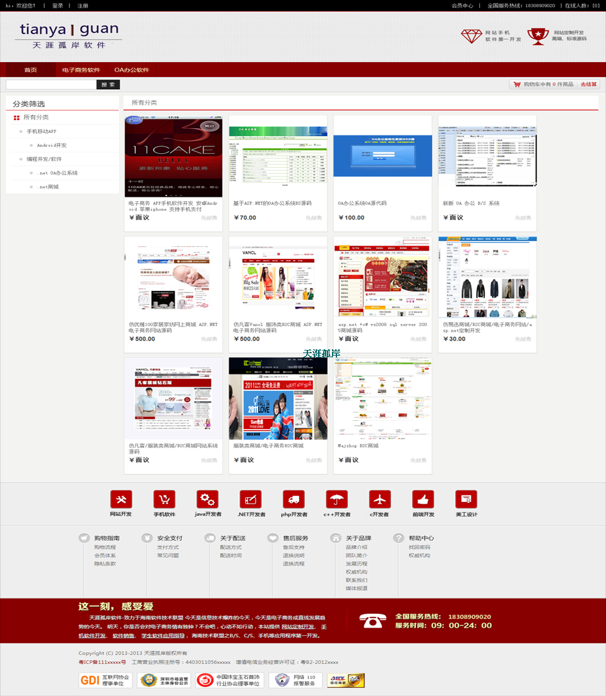
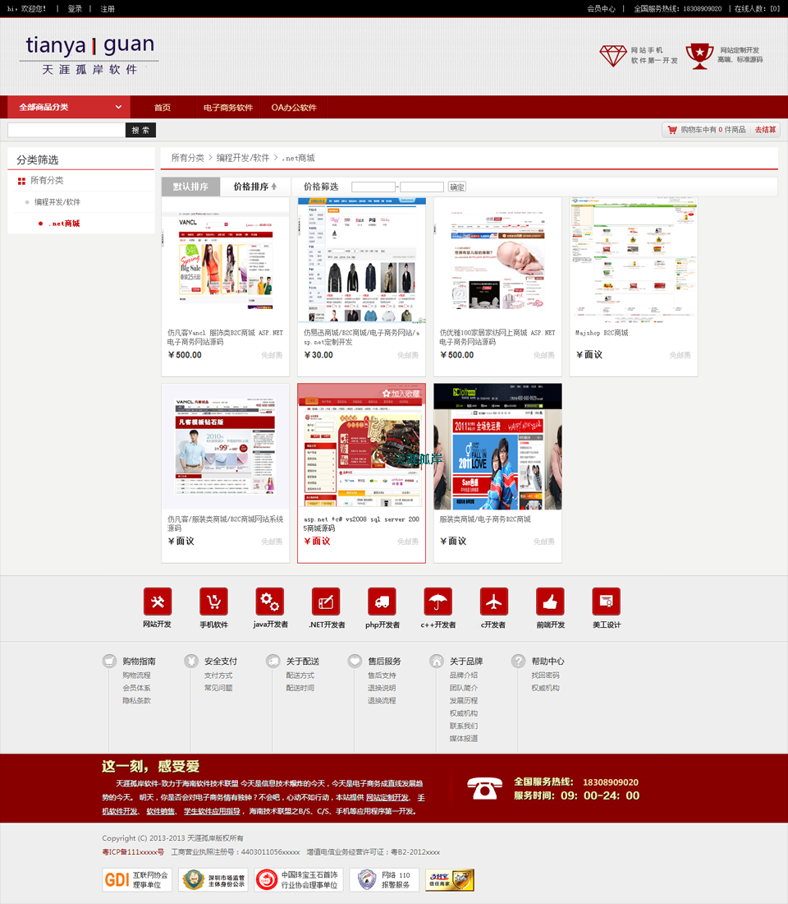
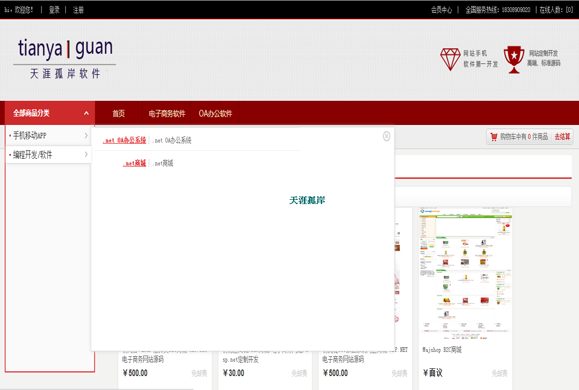
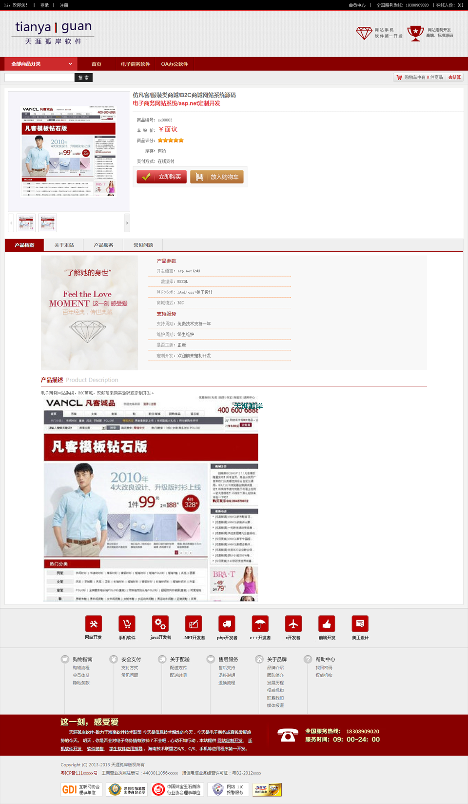
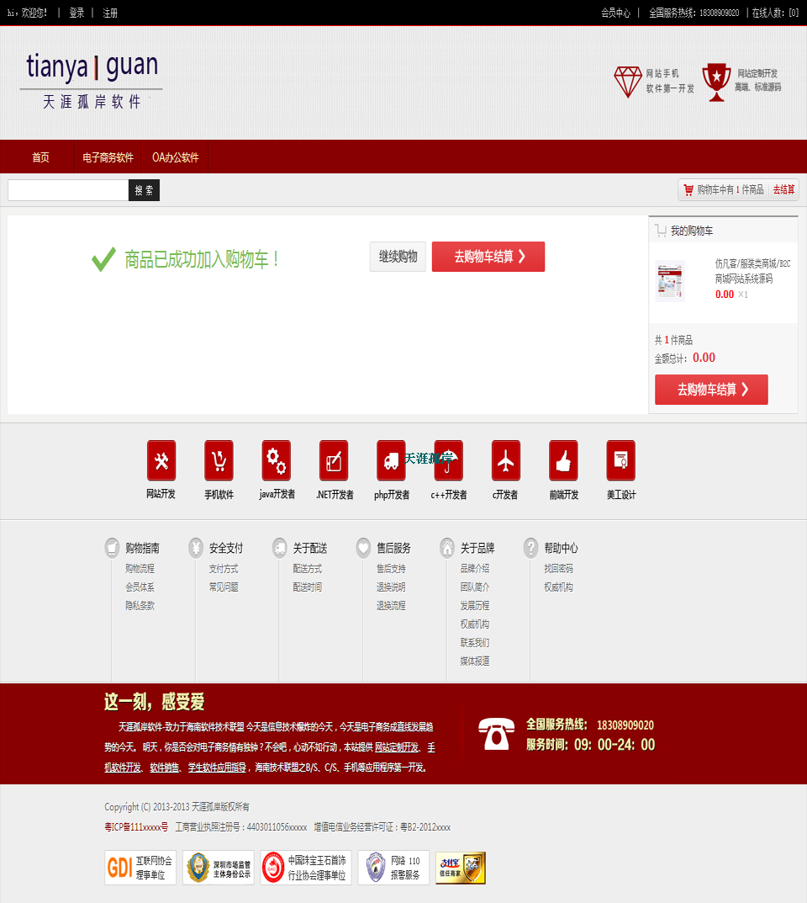
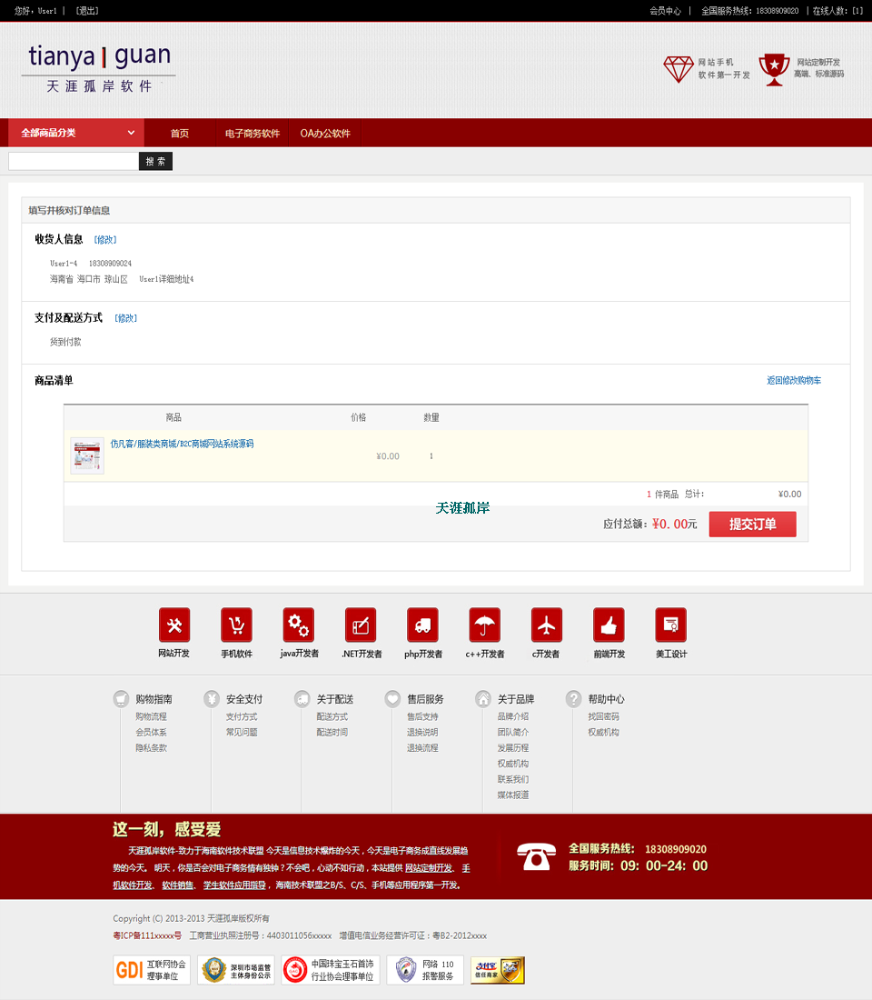
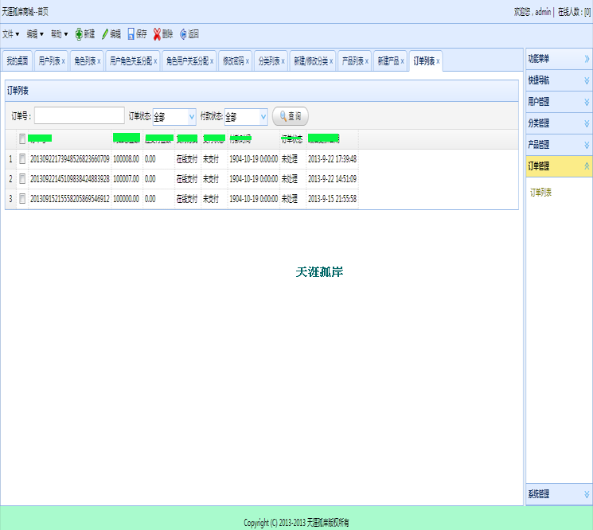

EcShop电子商务商城，一个具有后台（商品管理、钉钉管理）+前端（商品展示、购物车、下单）等完整功能的电子商务购物平台！

EcShop电子商务商城技术点标签：

后端：webservice、wcf、linq、ado.net、sql server、三层架构

前端：jquery、easyui、ionic、cordova

移动端：android、ios

技术、业务、交流联系：qq:283335746！

运行效果截图：

